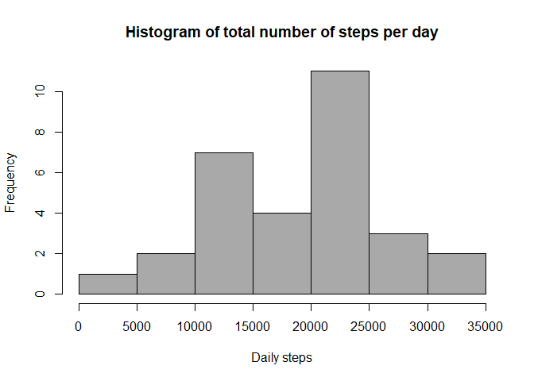
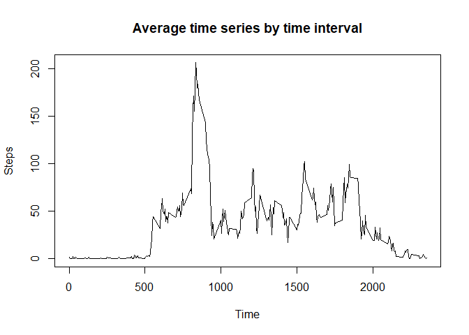
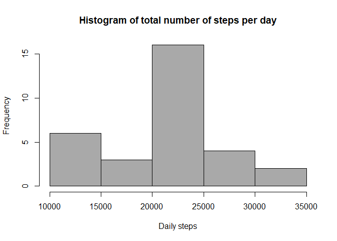
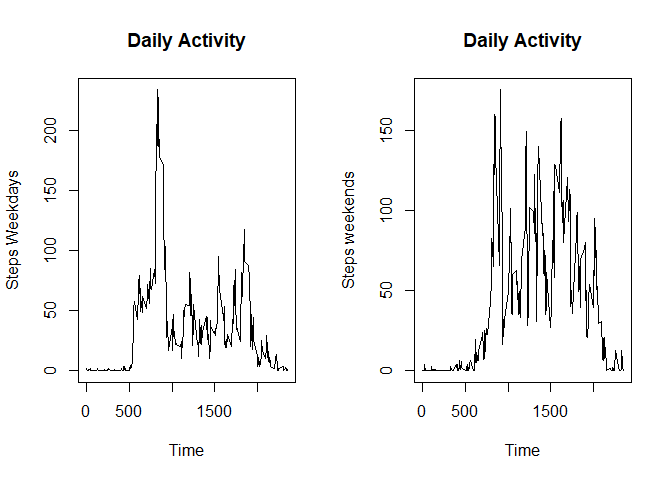

## Loading and preprocessing the data

1 - Import and set file time

```r
activity<-read.csv("activity.csv",header=T, na.strings = "NA")
activity$date <- as.Date(activity$date)
activity$steps <- as.numeric(activity$steps)
Sys.setlocale("LC_TIME", "English")
```

```
## [1] "English_United States.1252"
```

## What is mean total number of steps taken per day?

2 - Load packages

```r
library(lubridate)
```

```
## 
## Attaching package: 'lubridate'
```

```
## The following objects are masked from 'package:base':
## 
##     date, intersect, setdiff, union
```

```r
library(dplyr)
```

```
## 
## Attaching package: 'dplyr'
```

```
## The following objects are masked from 'package:stats':
## 
##     filter, lag
```

```
## The following objects are masked from 'package:base':
## 
##     intersect, setdiff, setequal, union
```

3 - Group the data by steps per day 

```r
activity<- mutate(activity, day = day(activity$date))
stepsum<-aggregate(steps~day,activity, sum)
```

4 - Histogram of the total number of steps per day

```r
hist(stepsum$steps, main = "Histogram of total number of steps per day", xlab="Daily steps", col = "darkgray")
```

<!-- -->

5 - Mean and median of total number of steps taken per day

```r
summary(stepsum$steps)[3:4]
```

```
##   Median     Mean 
## 20597.50 19020.27
```

## What is the average daily activity pattern?

6 - Graph of the time series, considering the time interval (5 minutes) and the average number of steps performed per day

```r
stepsdailypattern<-aggregate(steps~interval,activity, mean)
plot(steps~interval,stepsdailypattern, type ="l", lwd=1, lty=1, main = "Average time series by time interval", xlab = "Time", ylab = "Steps")
```

<!-- -->

7 - Five-minute interval with the highest average, when considering the maximum number of steps

```r
stepsdailypattern[which.max(stepsdailypattern$steps),]
```

```
##     interval    steps
## 104      835 206.1698
```

## Imputing missing values

8 - Total number of missing values (NA`s)

```r
sum(is.na(activity$steps))
```

```
## [1] 2304
```

9 - Replacement of missing values with average values of the steps for all days and intervals

```r
activity_noNA <- activity
activity_noNA$steps[is.na(activity$steps)] <- mean(activity$steps, na.rm = TRUE)
```

10 - Histogram of the total number of steps performed per day after replacing missing values

```r
activity_noNAsum<-aggregate(steps~day, activity_noNA, sum)
hist(activity_noNAsum$steps, main = "Histogram of total number of steps per day", xlab="Daily steps", col = "darkgray")
```

<!-- -->
11 - Mean and median of total number of steps taken per day after replacing missing values

```r
summary(activity_noNAsum$steps)[3:4]
```

```
##   Median     Mean 
## 21641.00 21185.08
```

## Are there differences in activity patterns between weekdays and weekends?

12 - Applying the weekdays function (package lubridate), it is possible to indicate the dates considered days of the week or weekend

```r
activity_wd<- mutate(activity, weekday = weekdays(activity$date))
activity_wd$weekday <- as.factor(activity_wd$weekday)
```


13 - Compare the average number of steps taken on weekdays and weekends from a time series graph considering a time interval (5 minutes) and the average number of steps taken

```r
weekend<-subset(activity_wd, activity_wd$weekday=="Saturday" | activity_wd$weekday=="Sunday")
weekday<-subset(activity_wd, activity_wd$weekday!="Saturday" & activity_wd$weekday!="Sunday")
dailypattern_wday<-aggregate(steps~interval,weekday, mean)
dailypattern_wend<-aggregate(steps~interval,weekend, mean)
par(mfrow=c(1,2))
plot(steps~interval,dailypattern_wday, type ="l", lwd=1, lty=1, main = "Daily Activity", xlab = "Time", ylab = "Steps Weekdays")
plot(steps~interval,dailypattern_wend, type ="l", lwd=1, lty=1, main = "Daily Activity", xlab = "Time", ylab = "Steps weekends")
```

<!-- -->
